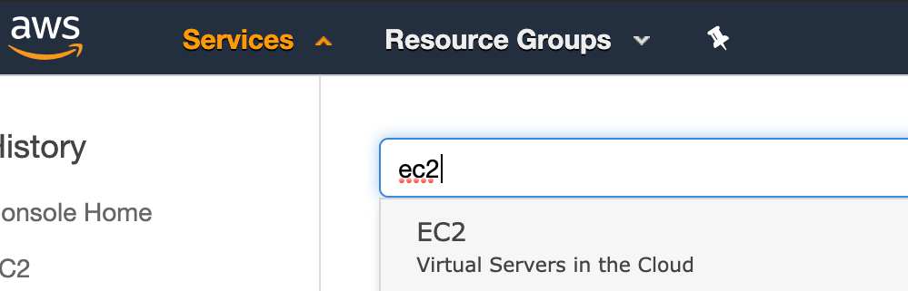
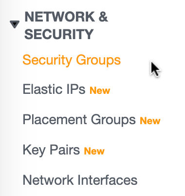
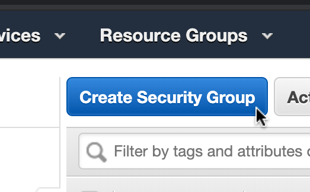
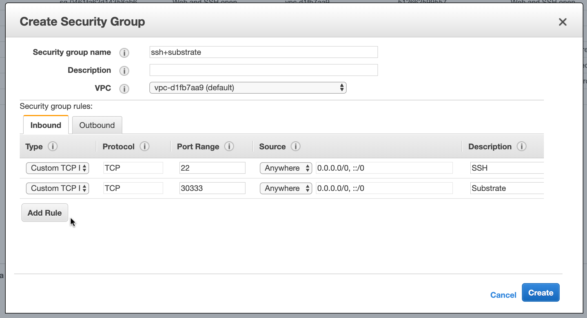
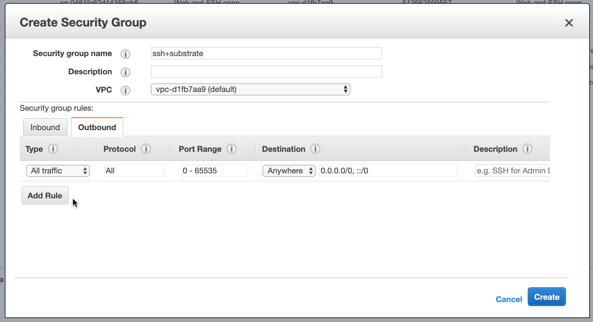
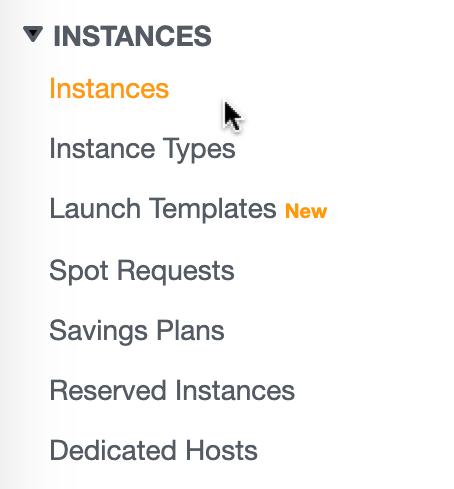
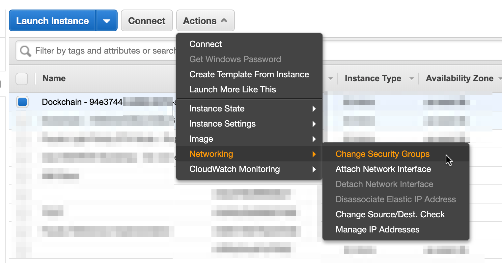
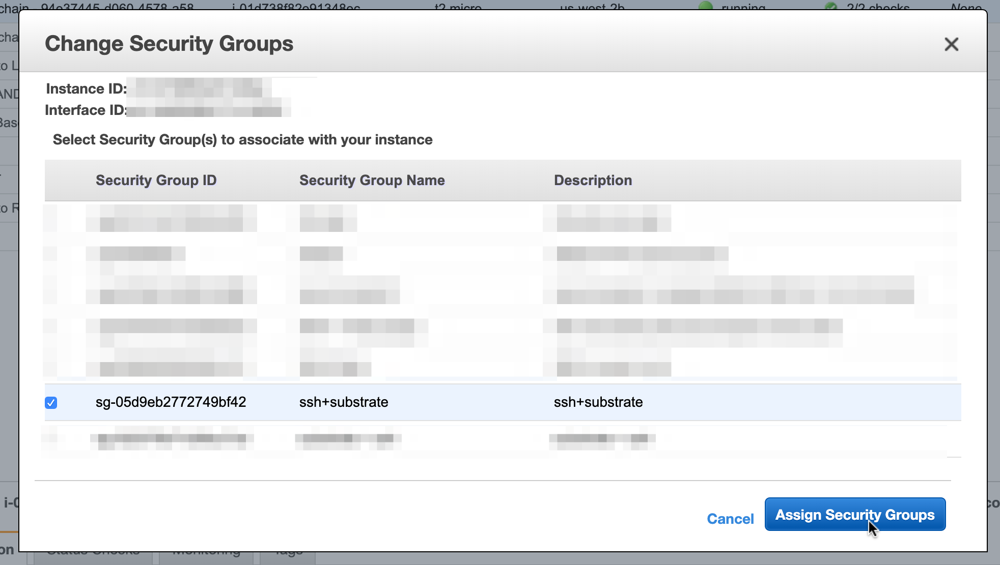

# Open ports in your EC2 instances

## Table of contents
- [Create a security group](#create-a-security-group) 
- [Attach a security group to your running EC2 instance](#attach-a-security-group-to-your-running-ec2-instance) 

## Create a security group
1. Log in to your [AWS Console](https://console.aws.amazon.com/)
1. Go to the EC2 dashboard      
1. Click on **Security Groups** under *Network & Security*      
1. Click on **Create Security Group**      
1. Enter the desired rules for inbound traffic. In this example we're opening TCP traffic from *anywhere* to ports 22 and 30333      
1. Enter the desired rules for outbound traffic. In this example we're allowing traffic to *anywhere* from all ports.       
1. Add a *Description* and click **Create**!
1. Done

## Attach a security group to your running EC2 instance
1. Go to your list of running instances by clicking **Instances** on the sidebar      
1. Select your running instance and and click: *Actions -> Networking -> Change Security Groups*      
1. Select your newly created security group and click *Assign Security Groups*      
1. Done
